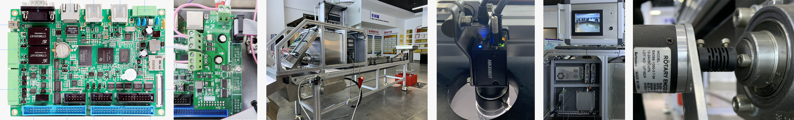

# 下位机

糖果分选机的下位机根据传送带脉冲等触发相机，接收上位机给的数据，按其要求控制阀板，用在各种分选机上。本次下位机采用的硬件是[广州致远电子股份有限公司 ](https://www.zlg.cn/)（周立功）的[EPC-9600I-L工控主板](https://www.zlg.cn/ipc/ipc/product/id/77.html)（简称EPC9600），自带各种接口，但是除了网口和DI/DO接口，其他接口统统用不到。阀板接口、触发相机的接口、编码器接口，都是连接自己做的IO扩展板，将IO扩展板插在底板DI/DO接口上，叠起来，因此称为叠板。



图中左到右分别为EPC9600，IO扩展板，糖果分选机整机，相机，上位机，编码器。其中，相机的触发线、编码器连接到IO扩展板，相机、上位机、EPC9600连接到以太网交换机。

IO扩展板提供了

- 1个12V电源输入
- 2个相机触发，1个为冗余
- 2个编码器输入，1个为冗余
- 4个阀板接口，3个为冗余

要注意，IO扩展板上的供电接口仅仅用于IO扩展板自身的供电，EPC9600的供电需要另外提供。<br>下面是接线图：


## 目录结构

- doc为说明文档，包括开发和部署细节、硬件设计的描述等
  - [deploy.md](./doc/deploy.md)为开发和部署说明，首先看这个文档
  - [hardware_description.md](./doc/hardware_description.md)为PCB设计说明

- script为配置系统、安装环境、安装可执行文件、卸载可执行文件等的脚本
- protocol为上位机和下位机通信的协议
- hardware下位机主板、接口板、底板等的硬件设计
- source为可执行文件的源程序

## 版本

由于经常有不同类型的新要求出现，比如分选糖果、分选烟梗、同为糖果也具有不同的参数，因此不同的下位机型号（注意不是更新，比如同一台机器需要设置新的参数）应建立不同的分支，**主分支无实际意义**

分支命名规则（不使用中文，小写无空格）

```shell
b分支编号-p生产环境项目名-t分选对象[-其他特点1[-其他特点2...]]
```

中括号在这里表示可省略的项，中括号本身不应出现在实际命名中，其他特点应字母打头，可有多个，"-"相连

使用Git的tag功能定义版本（注意连着tag一起push），Github仓库的release功能同步发布最新版本

版本号遵循定义如下（不使用中文，小写无空格）

```shell
b分支编号[-d文档版本]-hPCB设计版本[-lFPGA设计版本]-p协议版本[-s脚本版本]-aAPP代码版本[-i驱动版本][-c系统编译配置版本][-e设备树版本]
```

中括号在这里表示可省略的项，中括号本身不应出现在实际命名中。分支编号和分支命名中编号一致。各部分版本应在相应目录下创建文件注明，比如`2.1`版本的PCB设计：PCB工程目录中建立`version`文本文件，内容为文本`2.1`。对于涉及整体设计的大改动版本号加`1`，其余改动版本号加`0.1`。每个分支的版本各自独立，新分支的版本从`1.0`起计算

##  作者

作者觉得还是不说明作者是谁比较好，免得毕业后有提着示波器的师弟师妹来问问题