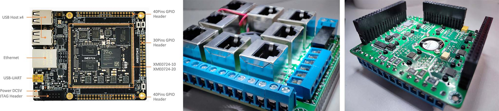

# 下位机

下位机根据传送带脉冲等触发相机，接收上位机给的数据，按其要求控制阀板。本次下位机采用的硬件是[Microphase](https://www.microphase.cn/)的XME0724CB ZYNQ开发板，具体核心板型号为XME0724-10，到手后记得把各排插针焊一下，如左图：



为了供电稳定，采用叠板给底板5V供电，由底板输出3.3V供回给叠板，叠板就是IO扩展板，将IO扩展板插在底板排针上，叠起来，因此称为叠板，如上图中和上图右。

IO扩展版提供了

- 1个12V电源输入
- 3个相机触发，2个为冗余
- 1个ZYNQ散热风扇接口 
- 6个编码器输入，5个为冗余
- 8个阀板接口，2个为冗余

接线时，12V电源连接到IO扩展板的电源接口，阀板从左到右应连接在阀板接口1~6上，相机线应连接相机触发接口`TRIG1`和对应的`GND`接口，编码器线应连接在编码器输入接口`E1`和对应的`GND`接口。注意底板不连接任何外部电源。

开发和部署说明见[doc/develop_and_deploy.md](doc/develop_and_deploy.md)

## 目录结构

- doc为说明文档，包括开发和部署细节、硬件设计的描述等

  - [develop_and_deploy.md](doc/develop_and_deploy.md)为开发和部署说明，首先看这个文档
  - [hardware_description.md](doc/hardware_description.md)为PL端逻辑设计说明，阐述了硬件工作的整体流程
  - [pl_reference_mannual.md](doc/pl_reference_mannual.md)为PL端逻辑在AXI总线上映射的寄存器参考手册

- script为配置系统、安装环境、安装可执行文件、卸载可执行文件等的脚本

  关于脚本的使用，见[doc/develop_and_deploy.md](doc/develop_and_deploy.md)

  - target.sh为嵌入式linux中自动启动应用程序脚本

  - load\*.sh为嵌入式linux中加载驱动的脚本
  - .bashrc为嵌入式linux中配置环境变量的脚本

- protocol为上位机和下位机通信的协议

- hardware下位机主板、接口板、底板等的硬件设计

  - pl_platform为PL端硬件设计
  - xme0724ioextend为IO叠板的原理图和PCB

- source为XME0724板子上运行的源程序

  - liunx_app为Linux上运行的应用程序，即业务逻辑
  - linux_driver为Linux上的驱动，用于控制自定义的PL端硬件
  - petalinux_config为petalinux工具在编译u-boot、kernel、rootfs前进行的配置
  - petalinux_devicetree为本次自定义的Linux设备树文件部分，其余设备树为自动生成的
  - petalinux_hwdescription为petalinux所使用的硬件描述文件，包含了vivado工程中的比特流等信息

## 版本

由于经常有不同类型的新要求出现，比如分选糖果、分选烟梗、同为糖果也具有不同的参数，因此不同的下位机型号（注意不是更新，比如同一台机器需要设置新的参数）应建立不同的分支，**主分支无实际意义**

分支命名规则（不使用中文，小写无空格）

```shell
b分支编号-p生产环境项目名-t分选对象[-其他特点1[-其他特点2...]]
```

中括号在这里表示可省略的项，中括号本身不应出现在实际命名中，其他特点应字母打头，可有多个，"-"相连

使用Git的tag功能定义版本（注意连着tag一起push），Github仓库的release功能同步发布最新版本

版本号遵循定义如下（不使用中文，小写无空格）

```shell
b分支编号-n编译号-h硬件版本-p协议版本-s脚本版本-r代码版本
```

分支编号和分支命名中编号一致

##  作者

作者觉得还是不说明作者是谁比较好，免得毕业后有提着示波器的师弟师妹来问问题