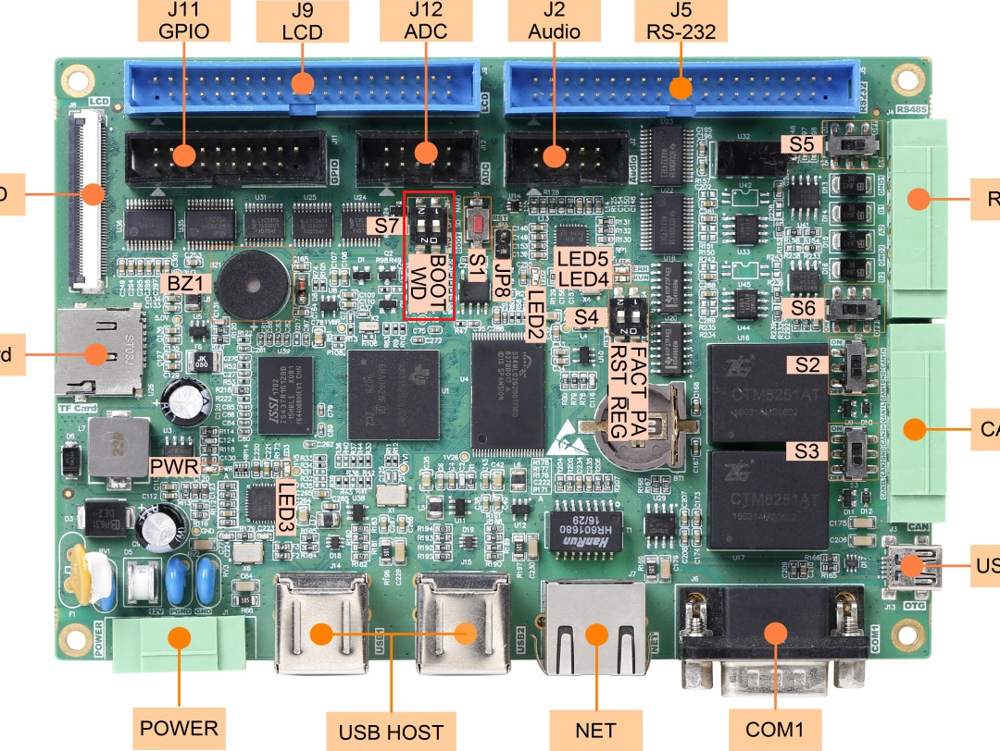
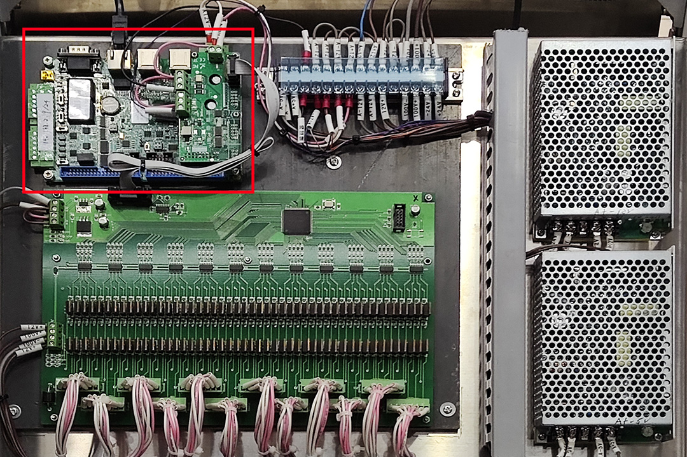

# 下位机的部署步骤

按下面标题的顺序进行，不要轻易跳过步骤，除非你知道你在做什么

## 硬件连接

### 启动方式选择

EPC-9600I-L支持从NAND或者SD卡启动，通过 S7拨码开关控制，拨码开关如图全部设置为OFF，表示从NAND启动。



### IO和供电连接

完成以下步骤后，应如下图所示

1. 将IO扩展板插入J1牛角座
2. 按接线图连接相机触发线、编码器的任一相、阀板
3. 按接线图连接IO扩展板的电源
4. 按接线图连接EPC9600的电源
5. 按接线图连接网线到交换机
6. 连接调试用电脑到交换机




启动交换机、EPC9600、IO扩展板的电源

## 软件配置

### 登录和配置

断开并禁用电脑连接的其他网络和网络适配器（包括无线网），将电脑连接EPC9600的网口设置到192.168.1.0/24网络中

SSH登录账号`root`，密码`root`<br>出厂默认IP为`192.168.1.136`

可以使用任何SSH软件进行登录，推荐`Xshell`，连接后执行下面的命令设置新的时间和IP：

```shell
[root@epc-9600  ~]# date 2023.02.08-15:34:00
[root@epc-9600  ~]# hwclock -w
[root@epc-9600  ~]# eeprom net set ip 192.168.2.9
```

时间不要照抄上面的命令，设置为当前时间即可，IP必须为`192.168.2.9`，执行下面命令重启

```shell
[root@epc-9600  ~]# reboot
```

### 安装下位机软件

因为设置了新的IP，所以将电脑连接EPC9600的网口设置为`192.168.2.11/24`，重新SSH连接IP为`192.168.2.9`的EPC9600。同时启动SFTP软件，推荐`Xftp`，将[script/S90target](../script/S90target)传输到EPC9600的`/tmp`中，运行下面命令配置下位机软件自启动：

```shell
[root@epc-9600  ~]# wr mv /tmp/S90target /etc/init.d/
[root@epc-9600  ~]# wr chmod 755 /etc/init.d/S90target
```

用相同的放将本仓库release中`app.zip`解压出的下位机软件`target`传输到EPC9600的`/tmp`中，运行下面命令安装下位机软件：

```shell
[root@epc-9600  ~]# wr mv /tmp/target /root
[root@epc-9600  ~]# wr chmod 755 /root/target
[root@epc-9600  ~]# sync
```