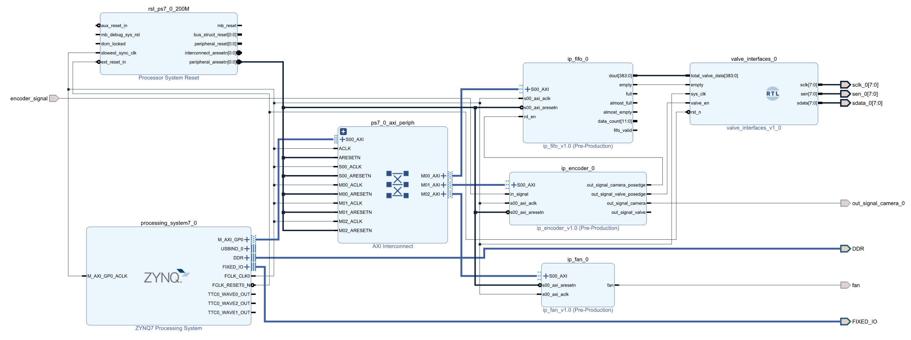

# 硬件平台

PL端主要由4个外设组成，分别时**风扇控制器**(FAN)，**编码和分频控制器**(ENCODER)，**先入先出队列**(FIFO)和**阀板控制器**(VALVE)。其中阀板控制器没有提供AXI接口，因此并没有映射寄存器，软件也无法进行控制。各个控制器的连接关系如下图所示。

由于开发板的PL端没有自带晶振，所以4个外设由统一的同步时钟驱动，时钟源来自PS端，为200MHz，软件不可修改。外部编码器信号输入**编码和分频控制器**，控制器根据软件设置的阀触发分频值和相机触发分频值对编码器信号进行分频，分频后的信号用于驱动喷阀动作和触发相机拍照。为同步触发相机和移出队列以及保持队列中数据的动态平衡，**先入先出队列**在相机触发同时输出一个数据，即**先入先出队列**读信号和相机触发共用同一个信号。而由于电磁阀的物理特性导致电磁阀无法以触发相机的频率进行开关，因此**阀板控制器**对先入先出队列输出总线上的数据进行重采样，即按照**编码和分频控制器**输出的阀触发信号更新并转换为阀板协议，输出电磁阀的状态。设计的风扇控制器用于驱动风扇的启停，给ZYNQ芯片进行降温，防止芯片过热导致工作中出现问题。

## 生成硬件描述文件

1. 创建名为test_lower_machine的工程，打开**Block Design**，添加ZYNQ7 Processing System、ip_fifo、ip_encoder、ip_fan、valve_interfaces模块。
2. 在ZYNQ7 Processing System中勾选Quad SPI Flash [1-6]、Ethernet 0 [16-27]、USB 0 [28-39]、SD 0 [40-45]、SD 1 [46-51]、UART 0 [14-15]、TTC 0 [EMIO]、GPIO MIO {Ethernet PHY Reset [7]、USB PHY Reset[8]}
3. 按顺序点击**Generate Outputs Product** -> **Create HDL Wrapper** -> **Generate Bitstream**，**File** -> **Export Export Hardware**  ，得到xsa文件。

## ENCODER模块

1. encoder模块自定义接口in_signal、out_signal_camera_posedge、out_signal_valve_posedge、out_signal_camera、out_signal_valve

2. in_signal接口与外部编码器相连，接收外部编码器信号

3. out_signal_camera为分频后的信号，用于驱动相机拍照

4. out_signal_camera_posedge为out_signal_camera的上升沿，该信号输出给fifo模块的rd_en接口，用来驱动fifo模块将数据加载到AXI总线上

5. out_signal_valve_posedge为out_signal_valve的上升沿，该信号输出给valve_interfaces模块的valve_en信号，用于输出AXI总线上的数据，驱动喷阀动作

6. ENCODER模块寄存器说明见[doc/pl_reference_mannual.md](pl_reference_mannual.md)中的ENCODER控制器部分

   

## FIFO模块

1. fifo模块自定义接口rd_en、dout[383:0]、empty、full、almost_full、almost_empty、data_count[11:0]、fifo_valid
2. rd_en接收out_signal_camera_posedge传来的信号，用来驱动fifo模块将数据加载到AXI总线上
3. dout[383:0]为驱动喷阀动作的总数据，数据位宽为384bit
4. 当empty信号拉高时，表示fifo中数据已经为空，无法输出有效数据
5. fifo模块寄存器说明见[doc/pl_reference_mannual.md](pl_reference_mannual.md)中的FIFO控制器部分

## FAN模块

1. fan模块自定义接口fan用于控制风扇的启停
2. fan模块寄存器说明见[doc/pl_reference_mannual.md](pl_reference_mannual.md)中的FAN控制器部分

> Note：fan模块代码中设计了PWM调速功能，但由于硬件兼容问题导致，无法观察到调速现象。但正常的启停可以做到

## VALVE_INTERFACES模块

1. valve_interfaces模块自定义接口total_valve_data[383:0]、empty、valve_en、sclk[7:0]、sen[7:0]、sdata[7:0]
2. total_valve_data[383:0]接收fifo模块dout接口传输的数据，对其重采样后由sdata接口输出给各个阀板
3. empty信号与fifo模块的empty信号相连。valve_interfaces模块检测到empty信号为高后，表示fifo中的数据被读空，此时将total_valve_data的384bit的数据全部置为0，然后输出给阀板
4. valve_en信号拉高后将384bit的数据输出给阀板，更新喷阀状态。该信号不拉高时则不更新喷阀状态
5. sclk[7:0]、sen[7:0]、sdata[7:0]为对应8块阀板的时钟信号线、使能信号线以及数据信号线
