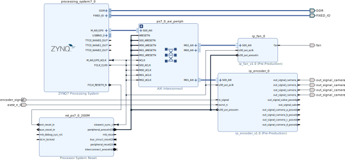

# 硬件平台

PL端主要由2个外设组成，分别时**风扇控制器**(FAN)，**编码和分频控制器**(ENCODER)，各个控制器的连接关系如下图所示。

由于开发板的PL端没有自带晶振，所以2个外设由统一的同步时钟驱动，时钟源来自PS端，为200MHz，软件不可修改。外部编码器信号和物体检测传感器信号输入**编码和分频控制器**，控制器根据软件设置的阀触发分频值和相机触发分频值对编码器信号进行分频，分频后的信号用于触发相机拍照。

**风扇控制器**用于驱动风扇的启停，给ZYNQ芯片进行降温，防止芯片过热导致工作中出现问题。由于风扇寿命短，因此目前采用散热片方案，风扇不开。

## PS模块

下面列出需要开启的外设和采用的IO口，BANK0为LVCMOS3.3V，BANK1为LVCOMS1.8V

| 外设                                                | IO                     | 备注                                   |
| --------------------------------------------------- | ---------------------- | -------------------------------------- |
| Quad SPI Flash                                      | 1~6                    | Single SS 4bit IO，Fast , ss_b pullup  |
| Ethernet 0 MDIO                                | 16~27  52~53      | Fast, all pullup                       |
| USB0                                                | 28~39                  | Fast, all pullup                       |
| SD0                                                 | 40~45                  | Fast, all pullup                       |
| SD1                                                 | 46~51                  | Fast, all pullup                       |
| UART0                                               | 14~15                  | all pullup, baud 115200, 8bits, 1 stop |
| TTC0                                                | EMIO                   |                                        |
| GPIO MIO Ethernet PHY Reset USB PHY Reset | 所有剩下的 7 8 | Fast, all pullup                       |

时钟配置上，ARM为666.66MHz，DDR为533.33MHz，用IOPLL给PL端提供200MHz的FCLK_CLK0。

如果用的是7010的板子，内存选忽略下面这一段：内存配置上，选择DDR3，数据位宽32bit=16bit/chip \* 2chip, 4096Mbits/chip，频率533.33，速度等级为1066F，行/列/Bank地址宽度为15/10/3，CL=7，CWL=6，RCD=7，RP=7，RC=51ns，FAW=40ns

ARM核上还开启AXI GP0接口与PL通信

## ENCODER模块

encoder模块主要接口为in_signal、out_signal_camera_a_posedge、out_signal_camera_b_posedge、out_signal_camera_c_posedge、out_signal_camera_d_posedge、out_signal_valve_posedge、out_signal_camera_a、out_signal_camera_b、out_signal_camera_c、out_signal_camera_d、out_signal_valve、exrst_n

终于，我们重新实现了被老倪乱起八糟的需求搞的几乎奔溃的模块，现在这个模块已经比较简洁了

1. in_signal接口与外部编码器相连，接收外部编码器信号
2. out_signal_camera_a到d最多课用于触发共4个相机
3. out_signal_camera_posedge_a到d为上述信号的上升沿，固定不连接。
4. out_signal_valve_posedge为out_signal_valve的上升沿，固定不连接。
5. exrst_n为可选的外部复位清零信号，可用于连接物体传感器，根据需要屏蔽相机触发输出

ENCODER模块输入输出频率的详细计算方式和寄存器说明见[doc/pl_reference_mannual.md](pl_reference_mannual.md)中的ENCODER控制器部分

