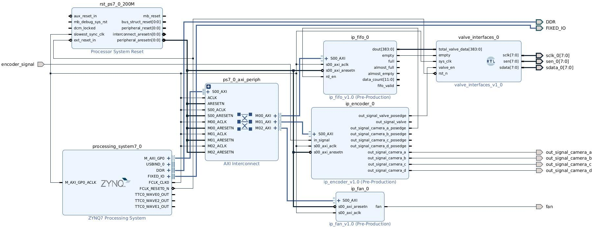

# 硬件平台

PL端主要由4个外设组成，分别时**风扇控制器**(FAN)，**编码和分频控制器**(ENCODER)，**先入先出队列*(FIFO)，阀板控制器**(VALVE)。其中阀板控制器没有提供AXI接口，因此并没有映射寄存器，软件也无法进行控制。各个控制器的连接关系如下图所示。

由于开发板的PL端没有自带晶振，所以4个外设由统一的同步时钟驱动，时钟源来自PS端，为200MHz，软件不可修改。外部编码器信号输入**编码和分频控制器**，控制器根据软件设置的阀触发分频值和相机触发分频值对编码器信号进行分频，分频后的信号用于驱动喷阀动作和触发相机拍照。光谱相机的触发频率较慢，为编码器频率/CDIV；彩色相机触发频率快，为⌊编码器频率/CDIV⌋\* 4。上位机发来的喷阀动作数据有两个，对应的分别是光谱和彩色相机的识别结果，都是为256宽度*1024高度。识别结果存储到**先入先出队列**中。

为同步触发相机和队列移出信号以及保持队列中数据的动态平衡，两个先入先出队列在彩色相机触发同时输出一个数据，即**先入先出队列**的读信号和彩色相机触发共用同一个信号。而由于电磁阀的物理特性导致电磁阀可能无法以触发相机的频率进行开关，因此**阀板控制器**对先入先出队列输出总线上的数据重采样，即按照**编码和分频控制器**输出的阀触发信号读入。两个先入先出队列移出的数据在**阀板控制器**中进行按位或运算，得到的数据转换为阀板协议，输出给阀板。**风扇控制器**用于驱动风扇的启停，给ZYNQ芯片进行降温，防止芯片过热导致工作中出现问题。由于风扇寿命短，因此目前采用散热片方案，风扇不开。

## PS模块

下面列出需要开启的外设和采用的IO口，BANK0为LVCMOS3.3V，BANK1为LVCOMS1.8V

| 外设                                                | IO                     | 备注                                   |
| --------------------------------------------------- | ---------------------- | -------------------------------------- |
| Quad SPI Flash                                      | 1~6                    | Single SS 4bit IO，Fast , ss_b pullup  |
| Ethernet 0 MDIO                                | 16~27  52~53      | Fast, all pullup                       |
| USB0                                                | 28~39                  | Fast, all pullup                       |
| SD0                                                 | 40~45                  | Fast, all pullup                       |
| SD1                                                 | 46~51                  | Fast, all pullup                       |
| UART0                                               | 14~15                  | all pullup, baud 115200, 8bits, 1 stop |
| TTC0                                                | EMIO                   |                                        |
| GPIO MIO Ethernet PHY Reset USB PHY Reset | 所有剩下的 7 8 | Fast, all pullup                       |

时钟配置上，ARM为666.66MHz，DDR为533.33MHz，用IOPLL给PL端提供200MHz的FCLK_CLK0。

如果用的是7010的板子，内存选忽略下面这一段：内存配置上，选择DDR3，数据位宽32bit=16bit/chip \* 2chip, 4096Mbits/chip，频率533.33，速度等级为1066F，行/列/Bank地址宽度为15/10/3，CL=7，CWL=6，RCD=7，RP=7，RC=51ns，FAW=40ns

ARM核上还开启AXI GP0接口与PL通信

## ENCODER模块

encoder模块主要接口为in_signal、out_signal_camera_posedge、out_signal_camera_posedge_x4、out_signal_valve_posedge、out_signal_camera、out_signal_camera_x4、out_signal_valve

接口比较乱，这个模块内部逻辑也实现的不优雅，这得怪老倪动不动就改需求

1. in_signal接口与外部编码器相连，接收外部编码器信号

2. out_signal_camera用于触发光谱相机拍照，可以认为光谱相机一次触发产生4行喷阀数据

3. out_signal_camera_x4则为out_signal_camera的4倍频率，触发彩色相机，彩色相机一次产生1行喷阀数据

4. out_signal_camera_posedge_x4为out_signal_camera_x4的上升沿，控制FIFO的读出

5. out_signal_valve_posedge为out_signal_valve的上升沿，驱动**阀板控制器**动作

ENCODER模块输入输出频率的详细计算方式和寄存器说明见[doc/pl_reference_mannual.md](pl_reference_mannual.md)中的ENCODER控制器部分

## FIFO模块

FIFO模块的主要接口为rd_en、dout[383:0]、empty、full、almost_full、almost_empty、data_count[11:0]、fifo_valid

1. rd_en接收ENCODER模块传来的信号，控制模块内部FIFO按ENCODER模块所需频率进行读取和输出
2. dout[383:0]为FIFO中读出数据，数据位宽为384bit
3. empty信号为1表示fifo中数据已经为空，无法输出有效数据，但输出寄存器仍然保持上次输出的值

FIFO模块寄存器说明见[doc/pl_reference_mannual.md](pl_reference_mannual.md)中的FIFO控制器部分

## FAN模块

fan模块接口fan输出为PWM波形，连接到外部的风扇驱动电路。

fan模块寄存器说明见[doc/pl_reference_mannual.md](pl_reference_mannual.md)中的FAN控制器部分

> Note：fan模块代码中设计了PWM调速功能，对于带程序的交流风扇，无法观察到调速现象。但正常的启停可以做到

## VALVE_INTERFACES模块

VALVE_INTERFACES模块的主要接口为total_valve_data[383:0]、empty、valve_en、sclk[7:0]、sen[7:0]、sdata[7:0]。VALVE_INTERFACES会将total_valve_data_a和total_valve_data_b两路数据进行或运算，得到同为384位的单路数据。

1. total_valve_data接收FIFO模块中读出的数据。

2. empty信号与两个FIFO模块的empty信号相连。检测到任意一个empty信号为高时，无论输入数据如何，只按协议输出全关给阀板。
3. valve_en信号上升沿将total_valve_data按协议发送给阀板
4. sclk[7:0]、sen[7:0]、sdata[7:0]连接到外部差分芯片，为最多8块阀板的时钟信号线、使能信号线以及数据信号线
