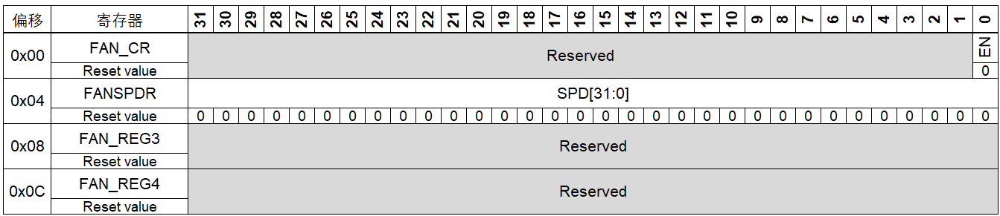
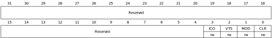
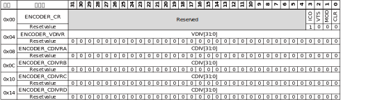

# PL 端自定义外设参考手册

## 存储器和总线架构

### 系统架构

PL端主要由2个外设组成，分别时**风扇控制器**(FAN)，**编码和分频控制器**(ENCODER)。各个控制器的连接关系如下图所示。

2个外设由统一的同步时钟驱动，时钟源来自PS端，为200MHz，软件不可修改。外部编码器信号和物体传感器信号输入**编码和分频控制器**，控制器根据软件设置的相机触发分频值对编码器信号进行分频。为同步触发相机。

具体的硬件设计和信号说明见[doc/hardware_description.md](hardware_description.md)

各控制器的边界地址和所属总线等信息如下表所示

| 边界地址                | 外设             | 总线      |
| ----------------------- | ---------------- | --------- |
| 0x43c10000 - 0x43c1ffff | 编码和分频控制器 | M_AXI_GP0 |
| 0x43c20000 - 0x43c2ffff | 风扇控制器       | M_AXI_GP0 |

## 风扇控制器 (FAN)

### FAN简介

FAN模块用于控  制散热风扇的启停以及通过PWM调整风扇速度。通过对寄存器写入值，该模块能正常启停散热风扇，但由于代码与硬件兼容问题，导致无法观察到调速现象。

### FAN主要特性

- 能控制风扇的启停
- 自定义占空比，调整风扇转速

### FAN功能说明

通过将开启使能拉高，开启风扇。通过向风速寄存器写入PWM占空值，控制风扇减少或提高风速。

### FAN寄存器说明

FAN模块寄存器主要包括控制寄存器 (FAN_CR)、风速寄存器 (FAN_SPDR)。控制寄存器 (FAN_CR)用于控制风扇开启或关闭的状态，风速寄存器 (FAN_SPDR)通过PWM技术设置风扇转动的速度。

**Base Address: 0x43c20000**  

#### FAN控制寄存器 (FAN_CR)

偏移地址: 0x00 复位值: 0x0000 0000

| **Field**    | **Description**                                              |
| :----------- | :----------------------------------------------------------- |
| 位31:16 保留 | 必须保持复位值                                               |
| 位0 **EN**   | 内部触发信号 (Virtual Triggle Signal)     0: 停止风扇     1: 开启风扇 |

#### FAN风速寄存器 (FAN_SPDR)

偏移地址: 0x04 复位值: 0x0000 0000

| **Field**      | **Description**                                              |
| :------------- | :----------------------------------------------------------- |
| 位31:0 **SPD** | 该寄存器值表示设置的风扇PWM占空值，占空比转换公式如下。 占空比% = SPD / (2 ^ 32 - 1) * 100% |

#### FAN寄存器映射

FAN寄存器可映射为32位可寻址寄存器，如下表所述：

## 编码和分频控制器 (ENCODER)

### ENCODER简介

ENCODER模块主要用于实现编码器计数以及对编码器脉冲进行分频，分频后的脉冲信号输出给相机。该模块包括1个控制寄存器 (ENCODER_CR)、阀触发分频寄存器 (ENCODER_VDIVR)、相机触发分频寄存器 (ENCODER_CDIVR)。

### ENCODER主要特性

- 独立设置对相机和喷阀的分频系数
- 内外两种触发模式选择
- 可选的外部清零方式

### ENCODER功能说明

下图给出了ENCODER的主要信号：

ENCODER模块接收编码器脉冲信号，通过设置的相机和喷阀分频系数，生成对应的触发信号。编码器脉冲信号可由内部或外部触发模式产生。

### ENCODER寄存器说明

ENCODER模块的寄存器主要有控制寄存器 (ENCODER_CR)、阀触发分频寄存器 (ENCODER_VDIVR)和相机触发分频寄存器 (ENCODER_CDIVR)。控制寄存器 (ENCODER_CR)用于进行触发模式选择以及复位清空，阀触发分频寄存器 (ENCODER_VDIVR)用于寄存输入的分频系数，将编码器脉冲除以分频系数得到触发脉冲。

**Base Address: 0x43c10000**

#### ENCODER控制寄存器 (ENCODER_CR)

偏移地址: 0x00 复位值: 0x0000 0008

| **Field**   | **Description**                                              |
| :---------- | :----------------------------------------------------------- |
| 位31:4 保留 | 必须保持复位值                                               |
| 位3 **ICO** | 仅限内部清除缓存 (Internal Clear Only)     0: 同时允许由外部输入**Ex CLR**和清除缓存位**CLR**控制进入清零状态         清零状态见位**CLR**的描述；外部输入为高时，退出清零状态     1: 仅限内部信号清除缓存 |
| 位2 **VTS** | 内部触发信号 (Virtual Triggle Signal)     **MOD**位置1时，由软件写入，将该位信号直接充当触发信号     0: 低电平     1: 高电平 |
| 位1 **MOD** | 模式选择 (Mode)     0: 外部触发模式，外部触发编码器转动     1: 内部触发模式，软件模拟触发信号 |
| 位0 **CLR** | 清除缓存 (Clear)    0: 清除编码和分频控制器内部的分频计数值，不影响ENCODER_VDIVR和ENCODER_CDIVRx  注意: 程序清零该位后需再写入1，使计数器退出清零状态，正常工作     1: 正常工作 |

#### ENCODER阀触发分频寄存器 (ENCODER_VDIVR)

偏移地址: 0x04 复位值: 0x0000 0000

| **Field**       | **Description**                                              |
| :-------------- | :----------------------------------------------------------- |
| 位31:0 **VDIV** | 阀触发分频值     阀控制器重采样频率和编码器脉冲的分频值， 写入数据后编码和分频控制器自动清除缓存并应用新的数值      注意：0表示不间断触发，即PL端每个时钟周期均触发阀模块 |

#### ENCODER相机触发分频寄存器 (ENCODER_CDIVRx)  (x=A...D) 

用于设定相机A到相机D的分频系数，各相机可独立设置

偏移地址: 0x08 复位值: 0x0000 0000

| **Field**       | **Description**                                              |
| :-------------- | :----------------------------------------------------------- |
| 位31:0 **CDIV** | 相机触发分频值     写入数据后编码和分频控制器自动清除缓存并应用新的数值      注意：0表示不间断触发，即PL端每个时钟周期均触发相机 |

#### ENCODER寄存器映射

ENCODER寄存器可映射为32位可寻址寄存器，如下表所述：

