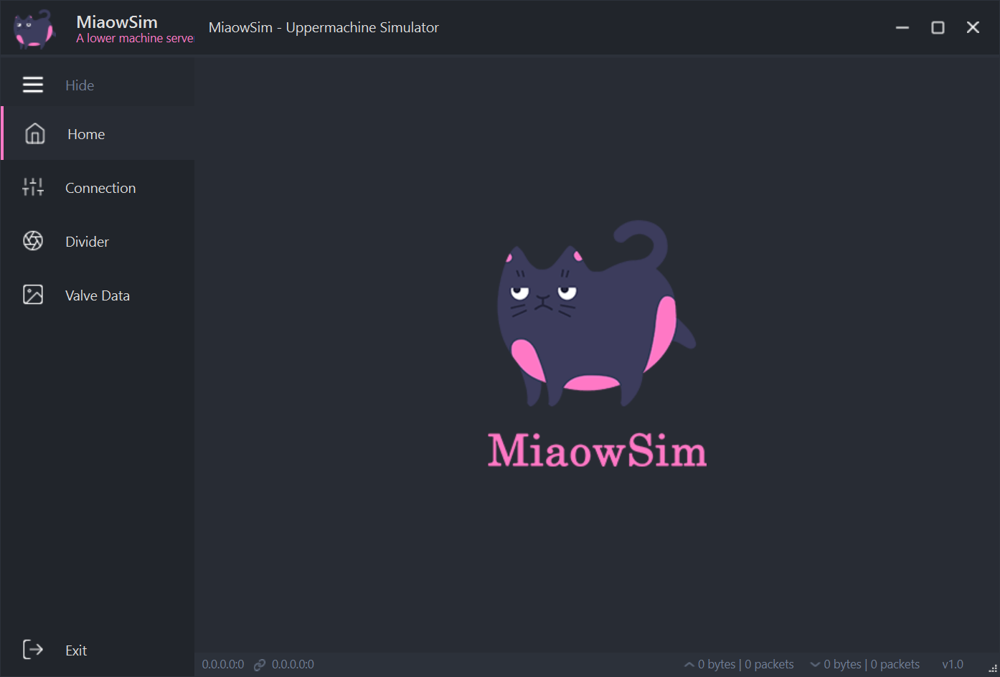

# 模拟上位机说明文档

## 模拟上位机连接下位机

模拟上位机使用python编写，如下图所示，实现显示界面并与下位机通信发送四个相机的分频值。运行程序后，出现显示界面，连接网线并选择Server IP为运行模拟上位机程序的本机系统中手动设定的IP地址，Server Port端号为13452(默认)。选择完成后等待连接，当界面下方出现本机与下位机的IP地址时即为连接成功。

## 模拟上位机发送指令

模拟上位机与下位机连接成功后，可在MANUAL栏中发送通信协议中对应的命令，在PRESET栏中填写四个相机触发所需的分频值，在发送分频值前，需要先点击停止按钮，然后点击对应的A、B、C、D按钮即可发送各相机对应的分频值，最后点击Start按钮即可将分频值发送给下位机。

